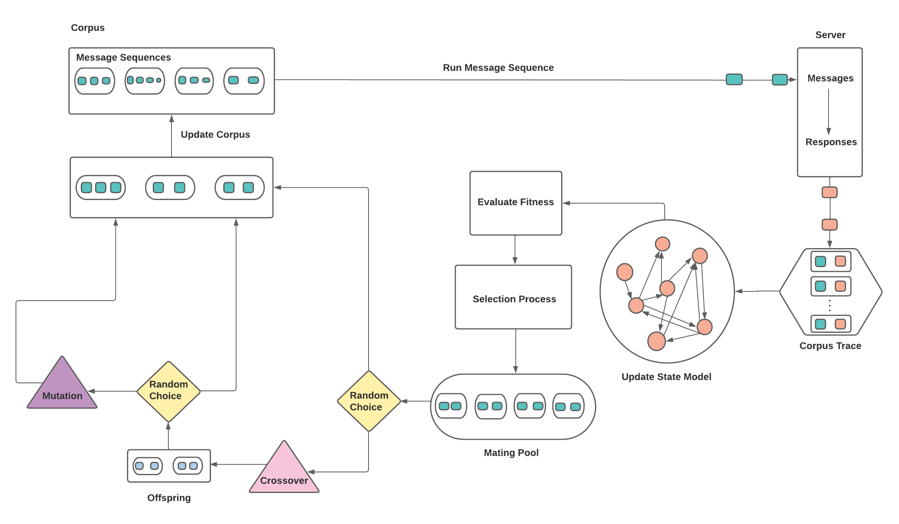
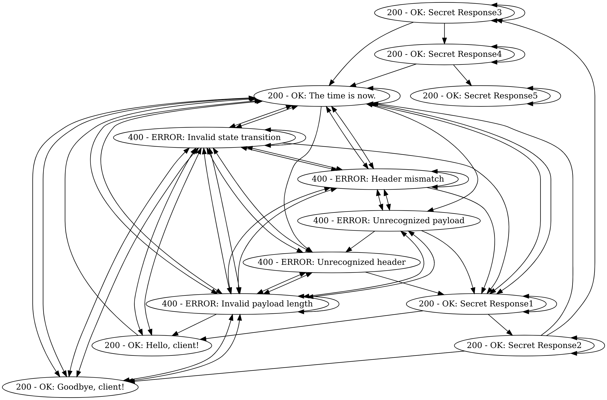

# Netic: Genetic Network Protocol Fuzzer

This Rust program is a genetic fuzzer for testing protocol implementations. The fuzzer utilizes an evolutionary algorithm and heuristics to generate protocol-specific message sequences that can potentially uncover bugs in the target protocol implementation.

### Overview

**Initialization**: In the beginning, the fuzzer initializes a corpus of message sequences and a message pool. The corpus is a collection of valid message sequences, while the message pool is a collection of individual messages used for mutation and crossover operations. The initial corpus can either be set randomly with the protocol-specific `random_message_sequence` methods, or it can be real message sequences extracted out of a given PCAP file. 

**Execution**: The fuzzer iteratively executes the following steps for a specified number of generations: 

1. Run message sequences from the corpus and record their interaction history. 

2. Update the message pool with randomly selected messages from the current message sequences. 

3. Process the interaction history to update the state model and identify unique and rare server states. 

4. Evaluate the fitness of each message sequence in the corpus based on coverage, rate of change, and presence of rare states.

5. Evolve the generation by applying selection, crossover, and mutation operations to create a new generation of message sequences.

After the specified number of generations have been created and tested, the final state model is converted into a digraph which then can be converted to PNG or SVG

### Notable Features

* **Genetic Algorithm:** The fuzzer uses a genetic algorithm to evolve message sequences, applying selection, crossover, and mutation operations. This helps explore diverse and potentially interesting test cases.

* **State Model:** The program builds and updates a state model of the server based on the server's responses to message sequences. This helps guide the fuzzer towards new and unexplored states.

* **Fitness Evaluation:** The fuzzer evaluates the fitness of message sequences based on various criteria, such as state coverage, state rarity, rate of change per sequence, and server response time. This allows the fuzzer to prioritize promising test cases.

* **Configuration:** The fuzzer provides a configurable framework with parameters for controlling the fuzzing process, such as selection pressure, mutation rate, crossover rate, message pool size, and state rarity threshold.

### Code Design

The key design aspect of this project is the use of the `Protocol` trait, which serves as a common interface for defining shared behavior across multiple network protocol implementations. By implementing the `Protocol` trait, you can easily extend the program to support new protocols.

The `Protocol` trait requires associated types for `MessageType`, `MessageSectionsKey`, `MessageSectionsValue`, and `ServerState`. Additionally, it specifies methods for creating, mutating, and parsing messages as well as handling crossover operations.

By using the `Self` type alias, the `Protocol` trait ensures that the `Message` struct and the implementing type share the same protocol. This prevents mixing different protocols and enforces a consistent implementation. The use of `Self` in the method signatures also allows for generic code that works with any type implementing the `Protocol` trait.

In summary, the flexible and extensible design is achieved through the use of Rust's trait system, making it easy to add support for new protocols by simply implementing the `Protocol` trait with the desired behavior and associated types. The majority of the code and its structure remains independent of any specific protocol, highlighting the reusability and adaptability of the design.
